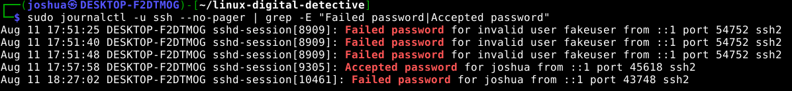
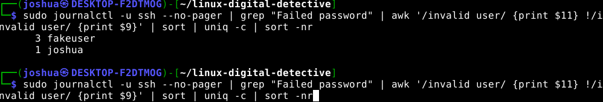
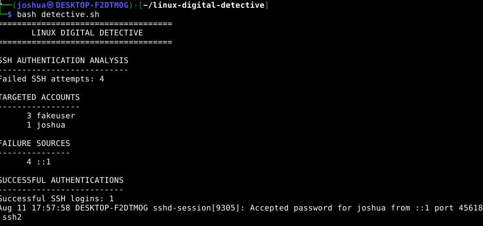

# 🕵️ Linux Digital Detective

A hands-on Linux security project that investigates SSH authentication activity using system logs and automates the analysis with a Bash script.

The goal of this project was not simply to write a script. I first generated authentication activity in a controlled lab, manually investigated the resulting logs, learned how to extract useful information from them, and then automated that investigation with Bash.

---

## 🎯 Project Objective

The Linux Digital Detective was built to answer several basic incident-response questions:

- How many failed SSH authentication attempts occurred?
- Which user accounts were targeted?
- Which source addresses generated the failed attempts?
- Were any SSH authentications successful?
- Which user successfully authenticated?
- What did the authentication timeline look like?

The final Bash script automatically gathers this information from the Linux system journal and produces a simple investigation report.

---

## 🧪 Lab Environment

This project was completed in a controlled local lab environment using:

- Kali Linux
- Bash
- OpenSSH
- systemd
- `journalctl`
- Linux command-line utilities

SSH authentication activity was intentionally generated against the local machine.

The address:

```text
::1
```

is the IPv6 loopback address, equivalent to IPv4 `127.0.0.1`.

Therefore, all authentication activity shown in this project originated from the local lab environment and does not represent an external attack.

---

## 🔎 Generating and Investigating SSH Activity

The OpenSSH service was enabled and authentication attempts were generated against both valid and invalid usernames.

The resulting authentication activity included:

- Three failed password attempts against the invalid account `fakeuser`
- One failed password attempt against the valid account `joshua`
- One successful SSH authentication for `joshua`

SSH authentication events were retrieved from the system journal using:

```bash
sudo journalctl -u ssh --no-pager
```

Authentication-specific events could then be isolated using `grep`.

```bash
sudo journalctl -u ssh --no-pager | grep -E "Failed password|Accepted password"
```

### Authentication Evidence



The logs show both failed and successful SSH authentication events, including the username, source address, source port, timestamp, and SSH session information.

---

## 🔐 Failed Authentication Analysis

Failed password attempts were isolated using:

```bash
sudo journalctl -u ssh --no-pager | grep "Failed password"
```

The total number of failed attempts can be determined with:

```bash
sudo journalctl -u ssh --no-pager | grep "Failed password" | wc -l
```

During this lab, four failed SSH password attempts were identified.

---

## 👤 Identifying Targeted Accounts

One of the most important lessons from this project was discovering that SSH authentication logs do not always have identical field structures.

An authentication attempt against an invalid username may appear as:

```text
Failed password for invalid user fakeuser from ::1
```

However, an incorrect password for a valid account may appear as:

```text
Failed password for joshua from ::1
```

This means that blindly extracting a fixed field with AWK can produce incorrect results.

For example:

```bash
awk '{print $11}'
```

does not mean "print the username."

It means:

> Print the 11th whitespace-separated field.

Depending on the structure of the log entry, field 11 could contain a username, IP address, or another value.

To account for both SSH log formats, conditional AWK logic was used:

```bash
awk '/invalid user/ {print $11} !/invalid user/ {print $9}'
```

The extracted usernames were then grouped, counted, and ranked:

```bash
sort | uniq -c | sort -nr
```

The resulting analysis identified:

```text
3 fakeuser
1 joshua
```

### Failed Login Analysis



---

## 🌐 Identifying Authentication Sources

The source address also changes field position depending on the SSH log format.

Instead of assuming that the IP address will always appear in a specific field, AWK searches for the word `from` and prints the value immediately following it:

```bash
awk '{for(i=1;i<=NF;i++) if($i=="from") print $(i+1)}'
```

The results can then be counted and ranked:

```bash
sort | uniq -c | sort -nr
```

During this lab, the failed authentication source analysis returned:

```text
4 ::1
```

Because `::1` is the IPv6 loopback address, this confirmed that all four failed authentication attempts originated from the local system.

---

## ✅ Successful Authentication Detection

Successful SSH password authentication events were identified using:

```bash
sudo journalctl -u ssh --no-pager | grep "Accepted password"
```

The lab contained one successful authentication:

```text
Accepted password for joshua from ::1
```

From the raw event, the investigation could identify:

- **User:** `joshua`
- **Source:** `::1`
- **Authentication result:** Successful
- **Authentication method:** Password
- **Service:** SSH

The phrase `Accepted password` provides evidence that authentication succeeded.

---

# 🕵️ Linux Digital Detective Script

After manually performing the investigation, the commands were combined into a Bash script named:

```text
detective.sh
```

The script automatically:

1. Counts failed SSH password attempts
2. Identifies targeted accounts
3. Counts attempts against each account
4. Identifies authentication source addresses
5. Counts successful SSH authentications
6. Displays successful authentication evidence

Example output:

```text
====================================
       LINUX DIGITAL DETECTIVE
====================================

SSH AUTHENTICATION ANALYSIS
---------------------------
Failed SSH attempts: 4

TARGETED ACCOUNTS
-----------------
3 fakeuser
1 joshua

FAILURE SOURCES
---------------
4 ::1

SUCCESSFUL AUTHENTICATIONS
--------------------------
Successful SSH logins: 1
Aug 11 17:57:58 ... Accepted password for joshua from ::1 ...
```

### Final Digital Detective Report



---

## 🚀 Running the Tool

Clone the repository and enter the project directory.

Give the script execute permission:

```bash
chmod +x detective.sh
```

Run the Digital Detective:

```bash
./detective.sh
```

The script can also be executed directly through Bash:

```bash
bash detective.sh
```

Depending on the system configuration, `sudo` privileges may be required to access journal data.

The tool expects SSH authentication events to be available through the systemd journal.

---

## 🧠 Skills Practiced

This project provided hands-on experience with:

### Linux Administration

- systemd services
- OpenSSH
- Linux permissions
- Bash scripting
- Linux process and session information

### Log Analysis

- `journalctl`
- Service-specific journal filtering
- Authentication event analysis
- Timeline investigation
- Failed vs. successful authentication events

### Command-Line Data Processing

- `grep`
- `awk`
- `sort`
- `uniq -c`
- `wc -l`
- Pipes (`|`)
- Pattern matching
- Conditional parsing

### Bash Scripting

- Variables
- Command substitution
- Script execution
- Executable permissions
- Automated reporting

### Security Analysis

- Authentication failure detection
- Successful-login detection
- Targeted account identification
- Source-address identification
- Event correlation
- Basic incident investigation

---

## 💡 Key Takeaways

The biggest lesson from this project was that effective log analysis requires understanding the structure of the underlying data.

Initially, extracting a specific AWK field appeared to work:

```bash
awk '{print $11}'
```

However, generating authentication attempts against both valid and invalid users demonstrated that SSH log structures can change.

Instead of simply memorizing field numbers, I had to understand what each log entry represented and adjust the parsing logic accordingly.

This reinforced an important security-analysis principle:

> **Understand the evidence before automating the analysis.**

The project also demonstrated how individual Linux commands can be chained together with pipes and then converted into a reusable Bash tool.

---

## 🔮 Future Improvements

Potential improvements to the Linux Digital Detective include:

- Time-range selection
- Detection thresholds for repeated authentication failures
- Automated suspicious-activity alerts
- Additional authentication methods
- Improved timeline generation
- Exporting investigation results to a report file
- Parsing additional Linux security logs
- IP enrichment for non-local authentication sources
- Python-based version of the detective tool

---

## ⚠️ Disclaimer

All authentication activity shown in this repository was intentionally generated in a controlled local lab environment for educational and defensive cybersecurity training.

This project is intended to demonstrate Linux administration, log analysis, Bash scripting, and defensive security investigation techniques.
